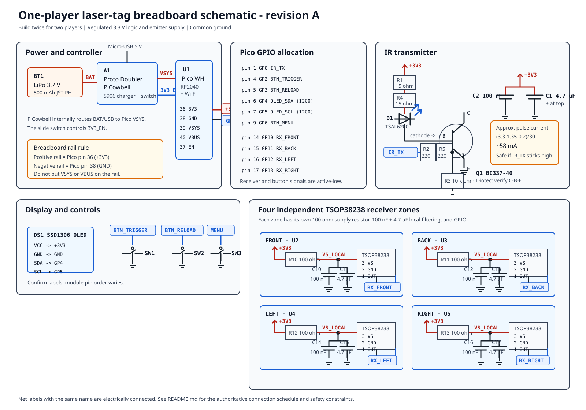
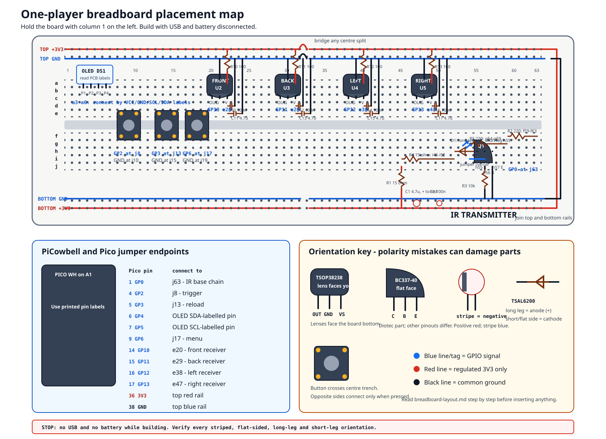

# Player prototype schematic

Build this circuit twice, once for each player. The schematic is intentionally
limited to the parts in `docs/shopping-list.md` and does not cover the later
wearable harness or permanent PCB.

For a hole-by-hole assembly drawing and beginner instructions, use
[`breadboard-layout.md`](breadboard-layout.md):

The SVG is the visual schematic. `pin-map.csv` records the GPIO allocation and
`connections.csv` is the machine-readable component netlist. The connection
schedule below is authoritative if a label in the drawing is difficult to
read.

## Fixed Pico pin map

| Function | Net | Pico GPIO | Physical pin |
|---|---|---:|---:|
| IR carrier output | `IR_TX` | GP0 | 1 |
| Trigger | `BTN_TRIGGER` | GP2 | 4 |
| Reload | `BTN_RELOAD` | GP3 | 5 |
| OLED data | `OLED_SDA` | GP4 | 6 |
| OLED clock | `OLED_SCL` | GP5 | 7 |
| Menu | `BTN_MENU` | GP6 | 9 |
| Front receiver | `RX_FRONT` | GP10 | 14 |
| Back receiver | `RX_BACK` | GP11 | 15 |
| Left receiver | `RX_LEFT` | GP12 | 16 |
| Right receiver | `RX_RIGHT` | GP13 | 17 |
| Regulated supply | `+3V3` | — | 36 |
| Ground | `GND` | — | 38 |

GP4 and GP5 are also connected to the PiCowbell's STEMMA QT socket. Nothing
else on the PiCowbell consumes those GPIOs. The generic four-pin OLED connects
to the PiCowbell's duplicate header or the breadboard with jumper wires; it
does not plug directly into the STEMMA QT socket.

## Power and breadboard rails

1. Plug the Pico WH into the Adafruit 5906 PiCowbell socket, observing the USB-end
   orientation printed on the board.
2. With USB disconnected and the PiCowbell switch off, verify the LiPo's red
   wire reaches the `+` side of the JST-PH socket, then connect it.
3. Connect Pico physical pin 36 (`3V3 OUT`) to the breadboard positive rail.
4. Connect Pico physical pin 38 (`GND`) to the breadboard negative rail.
5. If a breadboard power rail is split in the middle, bridge both halves.
6. Do not connect `VBUS` or `VSYS` to the positive breadboard rail.

The PiCowbell handles USB/battery selection and LiPo charging through the Pico's
Micro-USB connector. Its slide switch controls Pico `3V3_EN`; it is not in
series with the battery. The 500 mAh battery uses the PiCowbell's default
500 mA charge setting, so do not cut the charge-rate jumper.

## IR transmitter

| From | Through | To |
|---|---|---|
| `+3V3` | R1 and R4, both 15 Ω 1 W, in series | D1 TSAL6200 anode |
| D1 cathode | direct | Q1 BC337-40 collector |
| Q1 emitter | direct | `GND` |
| GP0 / `IR_TX` | R2 and R5, both 220 Ω, in series | Q1 base |
| Q1 base | R3, 10 kΩ | `GND` |
| `+3V3` | C1, 4.7 µF and C2, 100 nF in parallel | `GND` |

Put C1 and C2 close to R1/D1. C1 is polarized: connect its positive lead to
`+3V3`. C2 is not polarized. The TSAL6200's long lead is the anode; its short
lead and flat package edge identify the cathode.

For the purchased Diotec BC337-40, the manufacturer drawing labels the leads
`C-B-E` from left to right in its illustrated flat-face orientation. TO-92
pinouts are not universal: match the actual part to the linked Diotec
datasheet before inserting it.

At a typical LED forward voltage of 1.35 V and an assumed saturated transistor
drop of 0.2 V, the 30 Ω series pair gives approximately:

`(3.3 V - 1.35 V - 0.2 V) / 30 Ω = 58 mA`

This is below the TSAL6200's 100 mA continuous rating as well as its pulse
rating, making the initial breadboard build tolerant of a stuck-high output.
The two 220 Ω base resistors give about `(3.3 V - 0.8 V) / 440 Ω = 5.7 mA`,
which is sufficient forced base drive at this collector current without
loading the Pico GPIO near its 12 mA drive setting. `IR_TX` should still emit
only bounded 38 kHz packet bursts.

The transmitter is deliberately powered from regulated `+3V3`, not `VSYS`.
`VSYS` rises when USB is attached and would make a low-value emitter resistor
produce inconsistent and potentially excessive current.

## Receiver zones

Build the following circuit four times. Keep each 100 nF capacitor physically
beside its receiver:

| Zone | GPIO/net | Receiver reference | Filter references |
|---|---|---|---|
| Front | GP10 / `RX_FRONT` | U2 | R10, C10, C11 |
| Back | GP11 / `RX_BACK` | U3 | R11, C12, C13 |
| Left | GP12 / `RX_LEFT` | U4 | R12, C14, C15 |
| Right | GP13 / `RX_RIGHT` | U5 | R13, C16, C17 |

For every zone:

1. Connect `+3V3` through its 100 Ω resistor to the receiver's local `VS`.
2. Connect 100 nF ceramic and 4.7 µF electrolytic capacitors in parallel from
   local `VS` to `GND`; electrolytic positive goes to `VS`.
3. Connect TSOP38238 pin 3 (`VS`) to local `VS`.
4. Connect pin 2 (`GND`) to common `GND`.
5. Connect pin 1 (`OUT`) directly to the zone GPIO.

With the TSOP38238's rounded lens facing you and leads downward, the pins are
`OUT-GND-VS` from left to right. Its output is active-low and contains an
internal pull-up; firmware may also enable the Pico's internal pull-up.

Do not share the 100 Ω resistor between zones. Separate filters reduce
transmitter and Wi-Fi supply noise reaching the receivers.

## OLED and buttons

Connect the OLED `VCC`, `GND`, `SDA`, and `SCL` pins to `+3V3`, `GND`, GP4,
and GP5 respectively. Confirm the labels on the purchased module because
four-pin OLED modules do not all use the same physical pin order.

Connect one side of each normally-open button to its assigned GPIO and the
other side to `GND`:

- trigger: GP2;
- reload: GP3;
- menu: GP6.

The controls are active-low and rely on Pico internal pull-ups. A four-leg
tactile switch has two permanently connected legs on each side; place it
across the breadboard centre gap so pressing it joins the two sides.

## Layout rules

- Keep the R1–D1–Q1–GND high-current loop short and away from receiver outputs.
- Give the transmitter its own short ground return to the common ground rail.
- Keep each receiver's 100 nF capacitor and ground lead as short as possible.
- Do not run receiver output jumpers alongside the IR LED current loop.
- Only join supplies through named nets; never join `+3V3`, `VSYS`, and `VBUS`.
- Use one complete breadboard and one PiCowbell per player.

## Measurement points

Every breadboard node is accessible without adding components. Reserve jumper
access at:

- `TP_IR_GATE`: GP0 before R2;
- `TP_IR_LED`: D1 cathode / Q1 collector;
- `TP_RX_FRONT`, `TP_RX_BACK`, `TP_RX_LEFT`, `TP_RX_RIGHT`: the four outputs;
- `TP_SDA` and `TP_SCL`: GP4 and GP5;
- `TP_3V3`, `TP_VSYS`, and at least two ground points.

Do not measure current by placing a multimeter directly across a supply. Pulse
current characterization requires a suitable current shunt and oscilloscope;
that is a later range-testing step, not required to assemble this safe starting
circuit.

## Inspection before applying power

1. Remove USB and disconnect the LiPo.
2. Check every polarized part: LiPo connector, TSAL6200, and 4.7 µF capacitors.
3. Check Q1 collector, base, and emitter against the Diotec package drawing.
4. Check there is no jumper between the positive and negative rails.
5. Check every TSOP38238 receives power through its own 100 Ω resistor.
6. Check the IR LED path includes R1, R4, and Q1; it must not connect to GP0
   directly.
7. Apply power with the PiCowbell switch off, then switch on and stop
   immediately if a component heats, smells, discolours, or the battery swells.

The circuit has no useful autonomous behaviour until firmware is loaded.
Initial firmware must leave GP0 low during boot and enforce bounded IR bursts.

## Source references

- [Raspberry Pi Pico W datasheet](https://datasheets.raspberrypi.com/picow/pico-w-datasheet.pdf)
- [Raspberry Pi Pico pinout](https://datasheets.raspberrypi.com/pico/Pico-R3-A4-Pinout.pdf)
- [Adafruit Proto Doubler PiCowbell guide](https://cdn-learn.adafruit.com/downloads/pdf/adafruit-proto-doubler-picowbell.pdf)
- [Vishay TSAL6200 datasheet](https://www.vishay.com/docs/81010/tsal6200.pdf)
- [Vishay TSOP382/384 datasheet](https://www.vishay.com/docs/82491/tsop382.pdf)
- [Diotec BC337 series datasheet](https://diotec.com/request/datasheet/bc337.pdf)

